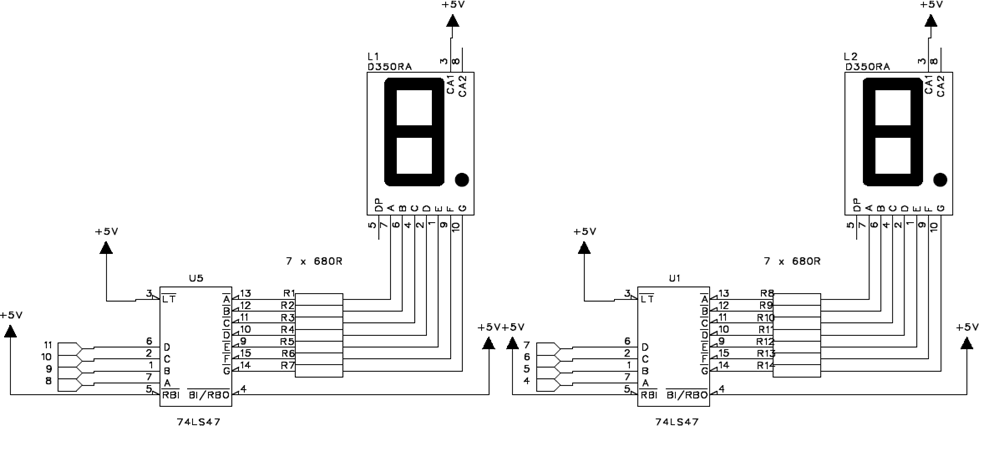
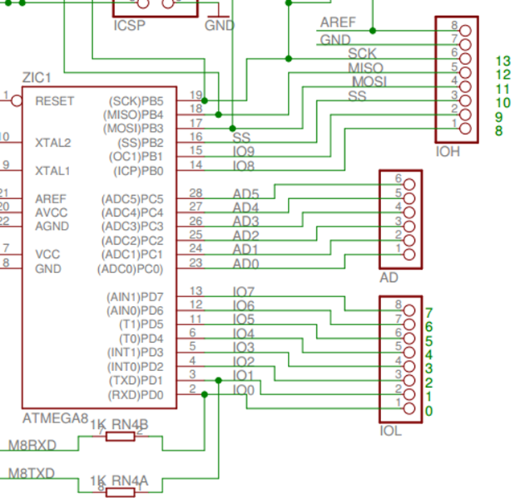
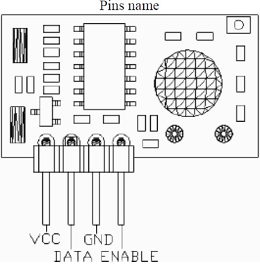

# Temperature radio-frequency transmitter  and  receiver

This is an Arduino project to create a simple temperature sensor receiving system and displaying via 7-segment LED display. Additionally, the project investigates serial data transmission between the transmitter and receiver, base on the fundamentals of RF (Radio Frequency) transmission.

## Required  equipment  and  components:
1.	HM-T433 RF transmitter 433.92 MHz 
2.	HM-R433 RF receiver 433.92 MHz 
3.	1 piece of 100 nF capacitor
4.	1 piece of 10 kΩ resistor
5.	14 pieces of 680 Ω resistor
6.	2 pieces of 74LS47
7.	2 pieces of common anode 7-segment display
8.	1 piece of Arduino UNO development board
9.	1 piece of USB cable (A-B connectors)
10.	1 PC with Arduino environment

## Step 1: The 7-segment displays
Make the connection as shown in Figure 1. Start with one display controller and one 7-Segment display. Connect it and write code which controls it. Then add the second display controller and display.
 - Use jumper wires to connect to the Arduino UNO board. Connect Arduino pins 4-11 to the 74LS47 display driver circuits.
	 - Figure 2 shows which I/O Ports the pins belong to and what Pin Numbers they correspond to on the Microcontroller 
	 - For example, Arduino Pin 4 is on PD4 (PortD pin 4).
	 - Arduino Pin 11 is in reality PORTB Pin3 (PB3) on the ATMega 328 Microcontroller. 
  - Figure 1 shows to which Pins on the Arduino Board the 74LS47 display controllers are connected. For
   example, the leftmost display controller, pin 6, is connected to Arduino Pin 11.    
 - The 7-segment displays are then connected to the display controllers.

###  Datasheets:
•	Display controller: it needs VCC and Ground (not shown in Figure 1). See 47LS47.pdf, page 1
•	Display: VCC, no Ground

## Step 2: Transmitter and receiver

Add another circuit board (breadboard) to the system according to Figure 3 and connect the DATA output of the RF circuit to Arduino pin 2, which serves as the software-implemented serial communication RX pin.

Connect a quarter-wavelength wire antenna (insulated hookup wire available in the laboratory can be used as an antenna). Calculate the length of the quarter-wavelength wire antenna in centimeters in the spreadsheet program using the formula λ=c/f, where c is the speed of light, f is the frequency, and λ is the wavelength."

The transmitter sends temperature readings 0-99 °C as follows:
1. the character `T` is sent
2. the temperature reading is sent
3. A large amount of the number `5´ is sent
4. back to step one

### Connections

Power to the RF circuit is taken from the Arduino board. Figure 3 shows the pin layout of the receiver.

 - Connect the DATA output of the RF circuit to Arduino pin 2
 - Connect one 10 kΩ resistor between the DATA pin of the RF circuit and the ground (GND)
 - Connect one 100 nF capacitor between VCC and ground (GND) on the breadboard
 - The Enable Pin on the RF circuit is connected to VCC (+5 v)

## Step 3:

Combine the 7 segment displays, it should show the temperature value without decimals.# arduino-temperature-tx-rx-7segments-led
